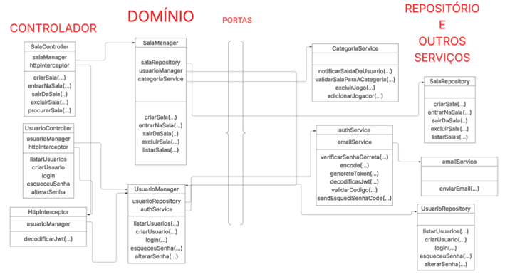

# 📌 RoomMakerBack

API em **Spring Boot** para gerenciamento de **salas virtuais**, utilizando **MongoDB**, autenticação via **JWT (RSA)**, **WebSockets** para comunicação em tempo real e documentação com **Swagger**.

O sistema permite que usuários **criem, procurem, entrem, saiam e excluam salas**. Cada sala pode ser de diferentes categorias, como **Jogo da Velha**, **Jokenpô** ou **Bate-papo**, e todas possuem um **chat em tempo real via WebSocket**.

Veja a aplicação completa hospedada [aqui](https://room-maker-front.vercel.app/)

Veja o código do Front-End [aqui](https://github.com/Gustavoksbr/RoomMakerFront)

---

## 🚀 1. Passo a passo para rodar o projeto localmente

---


### 🔨 1.1 Pré-requisitos

Antes de rodar o projeto, instale os seguintes componentes:

- [Java 17+](https://adoptium.net/)
- [MongoDB](https://www.mongodb.com/try/download/community) rodando em `localhost:27017`
- [Git](https://git-scm.com/)
- [Git Bash](https://gitforwindows.org/) (necessário para gerar chaves no Windows)

---

### 📂 1.2 Clonando o projeto

```bash
git clone https://github.com/Gustavoksbr/RoomMakerBack.git
cd RoomMakerBack
```

---

### 🔑 1.3 Configuração de chaves JWT

A autenticação utiliza **chaves RSA** que **não estão versionadas** por motivos de segurança.

#### Gerando as chaves

Na raiz do projeto, execute no **Git Bash**:

```bash
# Gera a chave privada (2048 bits)
openssl genrsa -out src/main/resources/app.key.priv 2048

# Extrai a chave pública
openssl rsa -in src/main/resources/app.key.priv -pubout -out src/main/resources/app.key.pub
```

Isso criará os arquivos:

- `src/main/resources/app.key.priv` → chave privada
- `src/main/resources/app.key.pub` → chave pública

---

### ⚙️ 1.4 Configuração do `application.properties`

O arquivo `src/main/resources/application.properties` deve ser configurado com as variáveis necessárias.

Você pode:
1. Definir as variáveis diretamente no `application.properties`, ou
2. Criar um arquivo `.env` na raiz do projeto (recomendado).

Exemplo de configuração:

````properties
spring.application.name=roommaker

spring.data.mongodb.uri=${ROOMMAKER_MONGODB_URI}
spring.data.mongodb.database=roommaker

jwt.private.key=classpath:app.key.priv
jwt.public.key=classpath:app.key.pub

server.port=8080
server.error.include-stacktrace=never

spring.mail.properties.mail.smtp.auth=true
spring.mail.properties.mail.smtp.starttls.enable=true

spring.mail.host=${ROOMMAKER_EMAIL_HOST}
spring.mail.port=${ROOMMAKER_EMAIL_PORT}
spring.mail.username=${ROOMMAKER_EMAIL}
spring.mail.password=${ROOMMAKER_EMAIL_PASSWORD}

cors.allowed-origins=http://localhost:4200,https://room-maker-front.vercel.app/
````

👉 Para conexão local com o MongoDB, defina:
```
ROOMMAKER_MONGODB_URI=mongodb://localhost:27017
```

Defina `spring.data.mongodb.database=` com o nome do seu banco de dados.  
Caso rode um serviço que consuma esta API (como o front-end), ajuste `cors.allowed-origins=` com sua URL.

---

### 📧 1.5 Configuração de envio de e-mails

O sistema envia e-mails para **recuperação de senha**.

Exemplo de configuração no `.env`:

````env
ROOMMAKER_MONGODB_URI=mongodb://localhost:27017
ROOMMAKER_EMAIL_HOST=smtp.gmail.com
ROOMMAKER_EMAIL_PORT=587
ROOMMAKER_EMAIL=seu-email@gmail.com
ROOMMAKER_EMAIL_PASSWORD=sua-senha-ou-app-password
````

🔗 Guia rápido para configurar no Gmail: https://youtu.be/_MwdIaMy_Ao?si=_O3NVEdCDNSwwh1u

---

### ▶️ 1.6 Executando o projeto

Na raiz do projeto, rode:

Se estiver usando **.env**:
```bash
./gradlew bootRun --args='--spring.config.import=optional:file:.env[.properties]'
```

Ou, se as variáveis estiverem no `application.properties`:
```bash
./gradlew bootRun
```

O servidor será iniciado em: [http://localhost:8080](http://localhost:8080)


### ⚠️ Boas práticas de segurança

🚫 **Nunca** versione suas chaves ou o arquivo `.env`.

Adicione ao `.gitignore`:
```
*.key.priv
*.key.pub
*.env
```
## 🏗  2. Arquitetura Hexagonal

A estrutura do projeto segue a divisão em três principais camadas:

### **Controller**
Responsável por lidar com as entradas (HTTP e WebSocket).

- **http/**
    - `config`: Configuração de CORS via `WebMvcConfigurer`.
    - `filters`: Filtro para validação de JWT.
    - `handler`: `RestControllerAdvice` para tratamento global de erros.
    - `sala`: Endpoints relacionados às salas (criar, entrar, sair, etc.).
    - `usuario`: Endpoints de autenticação e gerenciamento de usuários.

- **websocket/**
    - `config`: Configuração do WebSocket.
    - `filters`: Filtros aplicados às conexões.
    - `handler`: Tratamento de eventos e mensagens em tempo real.
    - `sala`: Gerenciamento de interações em salas.

> ⚠️ Não há `usuario/` em WebSocket, pois login, cadastro e recuperação de senha não utilizam WebSockets.

---

### **Domain**
Camada central, com as **regras de negócio**.

- **models/** → Classes de domínio (também utilizadas como DTOs).
- **ports/** → Interfaces que definem contratos de comunicação com serviços externos.
- **managers/** → Contém as classes principais de regra de negócio:
    - `SalaManager`
    - `UsuarioManager`
- **exceptions/** → Exceções personalizadas que podem ser lançadas em qualquer camada.

🔑 Importante: as classes de `domain/models` podem ser usadas em qualquer camada, mas cada camada também possui seus próprios **models específicos** (controllers para requisição/resposta, persistência para banco de dados).

---

### **Services**
Camada de implementação das portas, lidando com tecnologias externas.

- **auth/** → Autenticação via JWT.
- **categorias/** → Implementação da lógica de cada categoria de sala (jogos, bate-papo, etc.).
- **email/** → Envio de e-mails (ex.: recuperação de senha).
- **persistence/** → Persistência em MongoDB.

---



## 📚 3. Documentação da API

Este documento descreve os principais endpoints da API do **RoomMakerBack**, separados por controlador.

---

### 👤3.1 Usuário (usuario-controller)

### 🔑 Autenticação & Conta

#### `POST /usuario/esquecisenha`
Solicita envio de e-mail para recuperação de senha.

**Body Request**
```json
{
  "email": "string"
}
```

---

#### `POST /usuario/novasenha`
Redefine a senha de um usuário utilizando código enviado por e-mail.

**Body Request**
```json
{
  "email": "string",
  "codigo": "string"
}
```

---

#### `POST /login`
Realiza login do usuário.

**Body Request**
```json
{
  "username": "string",
  "password": "string"
}
```

---

#### `POST /cadastro`
Cria um novo usuário.

**Body Request**
```json
{
  "username": "string",
  "password": "string",
  "descricao": "string",
  "email": "string",
  "dataNascimento": "string"
}
```

---

#### `GET /usuarios`
Retorna a lista de usuários cadastrados.

---

## 🏠 3.2 Sala (sala-controller-http)

### 🔎 Consultas & Criação

#### `GET /salas`
Retorna todas as salas disponíveis.

---

#### `POST /salas`
Cria uma nova sala.

**Body Request**
```json
{
  "nome": "string",
  "categoria": "string",
  "senha": "string ",
  "qtdCapacidade": "integer"
}
```

---

#### `GET /salas/{usernameDono}/{nomeSala}`
Seleciona uma sala específica pelo dono e nome da sala.

---

### 🔑 Entrada & Gerenciamento

#### `POST /salas/{usernameDono}/{nomeSala}`
Entra em uma sala (pública ou privada).

**Body Request**
```json
{
  "senha": "string"
}
```

---

#### `DELETE /salas/{usernameDono}/{nomeSala}`
Exclui uma sala (apenas o dono pode realizar).

---

#### `GET /salas/_dono`
Lista todas as salas criadas pelo usuário logado.

---

#### `GET /salas/_convidado`
Lista todas as salas em que o usuário logado participa como convidado.

---

#### `DELETE /salas/{usernameDono}/{nomeSala}/{usernameParticipante}`
Remove um participante de uma sala. Pode ser feito:
- Pelo **dono** da sala (expulsar participante)
- Pelo **próprio usuário** (sair da sala)

---


